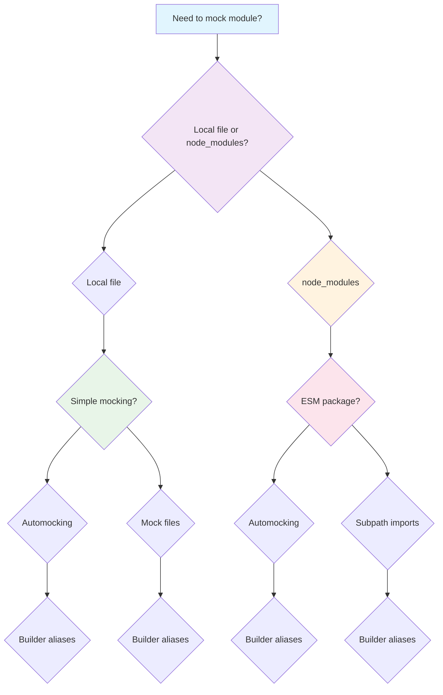

# SvelteKit Storybook Interaction Testing Cookbook v2

<!-- Updated with Storybook v9 Interaction Testing patterns on 2025-10-03 -->

A comprehensive cookbook for writing interaction tests within SvelteKit Storybook stories, focusing on component behavior testing through play functions and the 8 most complex user scenarios.

## Table of Contents

1. [Quick Start](#quick-start)
2. [Storybook Configuration for SvelteKit](#storybook-configuration-for-sveltekit)
3. [Writing Testable SvelteKit Components](#writing-testable-sveltekit-components)
4. [Mocking SvelteKit Features](#mocking-sveltekit-features)
5. [Complex Scenario Recipes](#complex-scenario-recipes)
6. [Test-Runner Automation](#test-runner-automation)
7. [CI/CD Integration](#cicd-integration)

---

## Quick Start

### Installation & Setup

```bash
# Install Storybook for SvelteKit
npx storybook@latest init --framework @storybook/sveltekit

# Install testing dependencies
npm install --save-dev @storybook/test @storybook/test-runner @playwright/test @playwright/experimental-ct-svelte
npx playwright install
```

### Basic Configuration

**`.storybook/main.ts`**:

```typescript
import type { StorybookConfig } from '@storybook/sveltekit';

const config: StorybookConfig = {
  stories: ['../src/**/*.mdx', '../src/**/*.stories.@(js|ts|svelte)'],
  addons: [
    '@storybook/addon-essentials',
    '@storybook/addon-interactions',
    '@storybook/addon-svelte-csf',
    '@storybook/addon-a11y'
  ],
  framework: {
    name: '@storybook/sveltekit',
    options: {
      builder: {
        viteConfigPath: 'vite.config.ts'
      }
    }
  },
  features: {
    buildStoriesJson: true
  },
  docs: {
    autodocs: true
  }
};

export default config;
```

**`playwright.config.ts`**:

```typescript
import { defineConfig, devices } from '@playwright/test';

export default defineConfig({
  testDir: './tests',
  fullyParallel: true,
  forbidOnly: !!process.env.CI,
  retries: process.env.CI ? 2 : 0,
  workers: process.env.CI ? 1 : undefined,
  reporter: 'html',

  use: {
    baseURL: 'http://127.0.0.1:6006',
    trace: 'on-first-retry',
    screenshot: 'only-on-failure'
  },

  projects: [
    { name: 'chromium', use: { ...devices['Desktop Chrome'] } },
    { name: 'firefox', use: { ...devices['Desktop Firefox'] } },
    { name: 'webkit', use: { ...devices['Desktop Safari'] } }
  ],

  webServer: {
    command: 'npm run storybook',
    url: 'http://127.0.0.1:6006',
    reuseExistingServer: !process.env.CI,
    timeout: 120 * 1000
  }
});
```

---

## Storybook Configuration for SvelteKit

### Preview Configuration with SvelteKit Mocks

**`.storybook/preview.ts`**:

```typescript
import type { Preview } from '@storybook/sveltekit';
import { spyOn } from 'storybook/test';

const preview: Preview = {
  parameters: {
    actions: { argTypesRegex: '^on[A-Z].*' },
    controls: {
      matchers: {
        color: /(background|color)$/i,
        date: /Date$/
      }
    },
    a11y: {
      test: 'error'
    },
    docs: {
      theme: {
        base: 'light',
        brandTitle: 'My SvelteKit App'
      }
    }
  },
  async beforeEach() {
    spyOn(console, 'log').mockName('console.log');
    spyOn(console, 'warn').mockName('console.warn');
    spyOn(console, 'error').mockName('console.error');
  }
};

export default preview;
```

### SvelteKit-Specific Mocking

**Mocking SvelteKit stores and navigation**:

```typescript
// MyComponent.stories.ts
import type { Meta, StoryObj } from '@storybook/sveltekit';

const meta = {
  component: MyComponent,
  parameters: {
    sveltekit_experimental: {
      stores: {
        page: {
          data: { user: { id: '123', name: 'Test User' } },
          url: new URL('http://localhost:6006/test'),
          params: {},
          route: { id: '/test' }
        }
      },
      navigation: {
        goto: (url: string) => console.log('Navigate to:', url),
        invalidate: (dep: string) => console.log('Invalidate:', dep)
      },
      forms: {
        enhance: () => console.log('Form enhanced')
      }
    }
  }
} satisfies Meta<typeof MyComponent>;

export default meta;
```

---

## Writing Testable SvelteKit Components

### Svelte 5 Component Patterns

**Testable component structure**:

```svelte
<!-- src/lib/components/ChatMessage/ChatMessage.svelte -->
<script lang="ts">
  import type { Message, User } from '$types';

  interface Props {
    message: Message;
    currentUser?: User | null;
    onEdit?: (messageId: string, content: string) => void;
    onDelete?: (messageId: string) => void;
    isLoading?: boolean;
  }

  let { message, currentUser, onEdit, onDelete, isLoading = false }: Props = $props();

  let isEditing = $state(false);
  let editedContent = $state(message.content);

  const isOwnMessage = $derived(
    currentUser && message.userId === currentUser.id
  );

  const canEdit = $derived(isOwnMessage && !isLoading);

  $effect(() => {
    if (!isEditing) {
      editedContent = message.content;
    }
  });

  function handleSave() {
    onEdit?.(message.id, editedContent);
    isEditing = false;
  }
</script>

<div class="message" data-testid="chat-message" class:own-message={isOwnMessage}>
  {#if isEditing}
    <textarea
      bind:value={editedContent}
      data-testid="edit-textarea"
      disabled={isLoading}
    />
    <div class="actions">
      <button onclick={handleSave} data-testid="save-button">Save</button>
      <button onclick={() => isEditing = false} data-testid="cancel-button">Cancel</button>
    </div>
  {:else}
    <p data-testid="message-content">{message.content}</p>
    {#if canEdit}
      <div class="actions">
        <button onclick={() => isEditing = true} data-testid="edit-button">Edit</button>
        <button onclick={() => onDelete?.(message.id)} data-testid="delete-button">Delete</button>
      </div>
    {/if}
  {/if}
</div>
```

### Props Design for Storybook Controls

```svelte
<script lang="ts">
  interface Props {
    variant?: 'primary' | 'secondary' | 'danger';
    size?: 'small' | 'medium' | 'large';
    disabled?: boolean;
    loading?: boolean;
    label: string;
    onclick?: () => void;
  }

  let {
    variant = 'primary',
    size = 'medium',
    disabled = false,
    loading = false,
    label,
    onclick
  }: Props = $props();
</script>

<button
  class={`btn btn-${variant} btn-${size}`}
  {disabled}
  data-loading={loading}
  {onclick}
  data-testid="action-button"
>
  {loading ? 'Loading...' : label}
</button>
```

---

## Mocking SvelteKit Features

### Complete SvelteKit Mocking Setup

```typescript
// .storybook/main.ts - Add to viteFinal
viteFinal: async (config) => {
  const { mergeConfig } = await import('vite');

  return mergeConfig(config, {
    resolve: {
      alias: {
        $lib: '/src/lib',
        $components: '/src/lib/components',
        $db: '/src/lib/server/database',
        $queries: '/src/lib/queries'
      }
    },
    define: {
      'import.meta.env.VITE_SUPABASE_URL': JSON.stringify('http://localhost:54321'),
      'import.meta.env.VITE_SUPABASE_ANON_KEY': JSON.stringify('test-key')
    }
  });
};
```

### Mocking External Dependencies

```typescript
// tests/setup/mocks.ts
import { vi } from 'vitest';

// Mock Supabase client
vi.mock('@supabase/supabase-js', () => ({
  createClient: vi.fn(() => ({
    from: vi.fn(() => ({
      select: vi.fn().mockResolvedValue({ data: [], error: null }),
      insert: vi.fn().mockResolvedValue({ data: null, error: null }),
      update: vi.fn().mockResolvedValue({ data: null, error: null }),
      delete: vi.fn().mockResolvedValue({ data: null, error: null })
    })),
    auth: {
      signInWithPassword: vi.fn().mockResolvedValue({ data: { user: null }, error: null }),
      signOut: vi.fn().mockResolvedValue({ error: null })
    }
  }))
}));

// Mock AI SDK
vi.mock('@ai-sdk/anthropic', () => ({
  anthropic: vi.fn(() => ({
    messages: {
      create: vi.fn().mockResolvedValue({
        content: [{ type: 'text', text: 'Mocked AI response' }]
      })
    }
  }))
}));
```

---

## Mocking Modules in Storybook

<!-- Verified via: Storybook Documentation Analysis on 2025-10-03 -->

### Why Mock?

Components often depend on other modules (utilities, libraries, APIs). Mocking lets you isolate component behavior, avoid side effects, and make tests deterministic.

### Main Mocking Options

#### 1. Automocking (Recommended for Vite/Webpack)

Register modules in `.storybook/preview.ts` using `sb.mock`. Three modes:

**Spy-only**: Keeps real implementations, but lets you observe & override:

```typescript
// .storybook/preview.ts
import { sb } from 'storybook/test';

sb.mock(import('uuid'), { spy: true });
```

**Fully automocked**: Replaces all exports with Vitest mocks:

```typescript
// .storybook/preview.ts
import { sb } from 'storybook/test';

sb.mock(import('../lib/session.ts'));
```

**Mock files**: Uses a `__mocks__` folder with custom implementations:

```typescript
// __mocks__/uuid.js
export function v4() {
  return '1234-5678-90ab-cdef';
}
```

Best for general mocking of local files or node_modules (with ESM).

#### 2. Mock Files

Place `__mocks__` next to module or in the project root (for node_modules). Must re-export all the same exports as original:

```typescript
// __mocks__/uuid.js
export function v4() {
  return '1234-5678-90ab-cdef';
}
```

#### 3. Subpath Imports

Use Node's "imports" in `package.json` for conditional mocks. Map real vs mock files under keys like "storybook" / "default":

```json
{
  "imports": {
    "#lib/session": {
      "storybook": "./lib/session.mock.ts",
      "default": "./lib/session.ts"
    }
  }
}
```

Update imports in components to use subpaths:

```typescript
// In components
import { getUserFromSession } from '#lib/session';
```

Good for strongly typed TypeScript projects or selective mocking.

#### 4. Builder Aliases

Configure your bundler to resolve imports to mock files instead of originals:

```typescript
// .storybook/main.ts
viteFinal: async (config) => {
  const { mergeConfig } = await import('vite');

  return mergeConfig(config, {
    resolve: {
      alias: {
        '@/lib/session': path.resolve(__dirname, './lib/session.mock.ts')
      }
    }
  });
};
```

Fallback if you can't use automocking or subpath imports.

### Mocking Network Requests

Use MSW (Mock Service Worker) with the `msw-storybook-addon`:

```typescript
// .storybook/main.ts
import { mswLoader } from 'msw-storybook-addon';

const config = {
  addons: ['msw-storybook-addon'],
  loaders: [mswLoader],
};
```

Initialize MSW in `.storybook/preview.ts`:

```typescript
// .storybook/preview.ts
import { initialize, mswLoader } from 'msw-storybook-addon';
import { http, HttpResponse } from 'msw';

initialize();

export const decorators = [
  (Story) => {
    // Global MSW handlers
    return Story();
  }
];
```

Define handlers per story using parameters.msw:

```typescript
export const WithAPI: Story = {
  parameters: {
    msw: {
      handlers: [
        http.get('/api/users/:id', ({ params }) => {
          return HttpResponse.json({
            id: params.id,
            name: 'Mock User',
            email: 'mock@example.com'
          });
        })
      ]
    }
  }
};
```

Supports REST (`http.get`) and GraphQL (`graphql.query`).

### Story Usage

Override mock behavior in `beforeEach` or `play` functions:

```typescript
export const MockedStory: Story = {
  args: {
    onSubmit: fn()
  },
  beforeEach: async () => {
    // Override mock behavior
    mocked(getUserFromSession).mockReturnValue({ name: 'John Doe' });
  },
  play: async ({ args }) => {
    // Test with mocked behavior
    await expect(args.onSubmit).toHaveBeenCalled();
  }
};
```

Mock functions are full Vitest spies (`mockReturnValue`, `mockResolvedValue`, `mockImplementation`). Cleanup is automatic (mocks reset between stories).

### Decision Flowchart: When to Choose Each Mocking Strategy



**When to use each:**

- **Automocking**: Simple, powerful, performant for most cases
- **Mock files**: Reusable behavior across stories
- **Subpath imports**: Conditional typing control
- **Builder aliases**: Fallback when above aren't viable

### Key Takeaways

- Use automocking first (simple, powerful, performant)
- Use mock files for reusable behavior
- Use subpath imports for conditional typing control
- Use builder aliases if the above aren't viable
- Use MSW for network requests (works cross-framework)

---

## Complex Scenario Recipes

### Recipe 1: User Registration with Full Validation

```typescript
// src/lib/components/RegisterForm/RegisterForm.stories.ts
import type { Meta, StoryObj } from '@storybook/sveltekit';
import { expect, fn, waitFor, within, userEvent } from '@storybook/test';
import RegisterForm from './RegisterForm.svelte';

const meta = {
  title: 'Auth/RegisterForm',
  component: RegisterForm,
  parameters: {
    layout: 'centered',
    sveltekit_experimental: {
      forms: {
        enhance: () => console.log('Form enhanced')
      }
    }
  }
} satisfies Meta<typeof RegisterForm>;

export default meta;
type Story = StoryObj<typeof meta>;

export const SuccessfulRegistration: Story = {
  args: {
    onSubmit: fn(async (data) => {
      await new Promise(resolve => setTimeout(resolve, 1000));
      return { success: true, userId: 'user-123' };
    })
  },
  play: async ({ args, canvas, step }) => {
    const screen = within(canvas);

    await step('Fill registration form', async () => {
      await userEvent.type(screen.getByTestId('name-input'), 'John Doe');
      await userEvent.type(screen.getByTestId('email-input'), 'john.doe@example.com');
      await userEvent.type(screen.getByTestId('password-input'), 'SecurePassword123!');
      await userEvent.type(screen.getByTestId('confirm-password-input'), 'SecurePassword123!');
    });

    await step('Submit registration', async () => {
      await userEvent.click(screen.getByTestId('register-button'));
      await expect(screen.getByTestId('loading-spinner')).toBeVisible();
    });

    await step('Verify successful registration', async () => {
      await waitFor(() => {
        expect(args.onSubmit).toHaveBeenCalledWith({
          name: 'John Doe',
          email: 'john.doe@example.com',
          password: 'SecurePassword123!'
        });
      });
    });
  }
};

export const ValidationErrors: Story = {
  args: {
    onSubmit: fn()
  },
  play: async ({ canvas, step }) => {
    const screen = within(canvas);

    await step('Submit empty form', async () => {
      await userEvent.click(screen.getByTestId('register-button'));
    });

    await step('Verify validation errors', async () => {
      await expect(screen.getByText('Name is required')).toBeVisible();
      await expect(screen.getByText('Email is required')).toBeVisible();
      await expect(screen.getByText('Password is required')).toBeVisible();
      await expect(screen.getByTestId('name-input')).toHaveAttribute('aria-invalid', 'true');
    });
  }
};

export const PasswordMismatch: Story = {
  args: {
    onSubmit: fn()
  },
  play: async ({ canvas, step }) => {
    const screen = within(canvas);

    await step('Enter mismatched passwords', async () => {
      await userEvent.type(screen.getByTestId('password-input'), 'Password123');
      await userEvent.type(screen.getByTestId('confirm-password-input'), 'DifferentPassword123');
      await userEvent.click(screen.getByTestId('register-button'));
    });

    await step('Verify password mismatch error', async () => {
      await expect(screen.getByText('Passwords do not match')).toBeVisible();
    });
  }
};
```

### Recipe 2: User Login with Authentication Flow

```typescript
// src/lib/components/LoginForm/LoginForm.stories.ts
import type { Meta, StoryObj } from '@storybook/sveltekit';
import { expect, fn, waitFor, within, userEvent } from '@storybook/test';
import LoginForm from './LoginForm.svelte';

const meta = {
  title: 'Auth/LoginForm',
  component: LoginForm,
  parameters: {
    layout: 'centered'
  }
} satisfies Meta<typeof LoginForm>;

export default meta;
type Story = StoryObj<typeof meta>;

export const SuccessfulLogin: Story = {
  args: {
    onSubmit: fn(async (credentials) => {
      await new Promise(resolve => setTimeout(resolve, 500));
      return { success: true, token: 'mock-jwt-token' };
    })
  },
  play: async ({ args, canvas, step }) => {
    const screen = within(canvas);

    await step('Enter login credentials', async () => {
      await userEvent.type(screen.getByTestId('email-input'), 'test@example.com');
      await userEvent.type(screen.getByTestId('password-input'), 'testpassword123');
    });

    await step('Submit login form', async () => {
      await userEvent.click(screen.getByTestId('login-button'));
      await expect(screen.getByTestId('loading-spinner')).toBeVisible();
    });

    await step('Verify successful login', async () => {
      await waitFor(() => {
        expect(args.onSubmit).toHaveBeenCalledWith({
          email: 'test@example.com',
          password: 'testpassword123'
        });
      });
    });
  }
};

export const InvalidCredentials: Story = {
  args: {
    onSubmit: fn(async () => {
      throw new Error('Invalid credentials');
    })
  },
  play: async ({ canvas, step }) => {
    const screen = within(canvas);

    await step('Enter invalid credentials', async () => {
      await userEvent.type(screen.getByTestId('email-input'), 'wrong@example.com');
      await userEvent.type(screen.getByTestId('password-input'), 'wrongpassword');
      await userEvent.click(screen.getByTestId('login-button'));
    });

    await step('Verify error message', async () => {
      await waitFor(() => {
        expect(screen.getByText('Invalid email or password')).toBeVisible();
      });
    });
  }
};

export const AccountLockout: Story = {
  args: {
    onSubmit: fn()
  },
  play: async ({ canvas, step }) => {
    const screen = within(canvas);

    await step('Simulate 5 failed attempts', async () => {
      for (let i = 0; i < 5; i++) {
        await userEvent.clear(screen.getByTestId('email-input'));
        await userEvent.clear(screen.getByTestId('password-input'));
        await userEvent.type(screen.getByTestId('email-input'), 'test@example.com');
        await userEvent.type(screen.getByTestId('password-input'), 'wrongpassword');
        await userEvent.click(screen.getByTestId('login-button'));
        await expect(screen.getByText('Invalid email or password')).toBeVisible();
      }
    });

    await step('Try correct password after lockout', async () => {
      await userEvent.clear(screen.getByTestId('email-input'));
      await userEvent.clear(screen.getByTestId('password-input'));
      await userEvent.type(screen.getByTestId('email-input'), 'test@example.com');
      await userEvent.type(screen.getByTestId('password-input'), 'correctpassword');
      await userEvent.click(screen.getByTestId('login-button'));
    });

    await step('Verify account lockout', async () => {
      await expect(screen.getByText('Account temporarily locked')).toBeVisible();
    });
  }
};
```

### Recipe 3: Create New Chat with Model Selection

```typescript
// src/lib/components/ChatCreation/ChatCreation.stories.ts
import type { Meta, StoryObj } from '@storybook/sveltekit';
import { expect, fn, waitFor, within, userEvent } from '@storybook/test';
import ChatCreation from './ChatCreation.svelte';

const meta = {
  title: 'Chat/ChatCreation',
  component: ChatCreation,
  parameters: {
    layout: 'centered',
    sveltekit_experimental: {
      navigation: {
        goto: fn((url) => console.log('Navigate to:', url))
      }
    }
  }
} satisfies Meta<typeof ChatCreation>;

export default meta;
type Story = StoryObj<typeof meta>;

export const CreateChatWithTitle: Story = {
  args: {
    onCreate: fn(async (title) => {
      await new Promise(resolve => setTimeout(resolve, 300));
      return { id: 'chat-new', title, createdAt: new Date().toISOString() };
    })
  },
  play: async ({ args, canvas, step }) => {
    const screen = within(canvas);

    await step('Open new chat dialog', async () => {
      await userEvent.click(screen.getByTestId('new-chat-button'));
      await expect(screen.getByTestId('new-chat-dialog')).toBeVisible();
    });

    await step('Enter chat title', async () => {
      await userEvent.type(screen.getByTestId('chat-title-input'), 'AI Assistant Chat');
      await userEvent.click(screen.getByTestId('chat-title-input'));
    });

    await step('Submit creation', async () => {
      await userEvent.click(screen.getByTestId('create-chat-button'));
    });

    await step('Verify chat created', async () => {
      await waitFor(() => {
        expect(args.onCreate).toHaveBeenCalledWith('AI Assistant Chat');
      });
    });
  }
};

export const CreateChatWithModelSelection: Story = {
  args: {
    onCreate: fn(),
    models: [
      { id: 'claude-sonnet-4', name: 'Claude Sonnet 4', provider: 'anthropic' },
      { id: 'gpt-4', name: 'GPT-4', provider: 'openai' },
      { id: 'gemini-pro', name: 'Gemini Pro', provider: 'google' }
    ]
  },
  play: async ({ args, canvas, step }) => {
    const screen = within(canvas);

    await step('Open new chat dialog', async () => {
      await userEvent.click(screen.getByTestId('new-chat-button'));
    });

    await step('Select AI model', async () => {
      await userEvent.click(screen.getByTestId('model-selector'));
      await userEvent.click(screen.getByText('GPT-4'));
    });

    await step('Enter title and create', async () => {
      await userEvent.type(screen.getByTestId('chat-title-input'), 'GPT-4 Chat');
      await userEvent.click(screen.getByTestId('create-chat-button'));
    });

    await step('Verify model selection', async () => {
      await waitFor(() => {
        expect(args.onCreate).toHaveBeenCalled();
      });
    });
  }
};

export const ValidationErrors: Story = {
  args: {
    onCreate: fn()
  },
  play: async ({ canvas, step }) => {
    const screen = within(canvas);

    await step('Open dialog and submit without title', async () => {
      await userEvent.click(screen.getByTestId('new-chat-button'));
      await userEvent.click(screen.getByTestId('create-chat-button'));
    });

    await step('Verify validation error', async () => {
      await expect(screen.getByText('Chat title is required')).toBeVisible();
    });
  }
};
```

### Recipe 4: Send Message with AI Response

```typescript
// src/lib/components/ChatInterface/ChatInterface.stories.ts
import type { Meta, StoryObj } from '@storybook/sveltekit';
import { expect, fn, waitFor, within, userEvent } from '@storybook/test';
import ChatInterface from './ChatInterface.svelte';

const meta = {
  title: 'Chat/ChatInterface',
  component: ChatInterface,
  parameters: {
    layout: 'fullscreen'
  }
} satisfies Meta<typeof ChatInterface>;

export default meta;
type Story = StoryObj<typeof meta>;

export const SendMessageAndReceiveResponse: Story = {
  args: {
    onSendMessage: fn(async (content) => {
      await new Promise(resolve => setTimeout(resolve, 200));
      return { id: 'msg-new', content, timestamp: Date.now() };
    }),
    currentModel: 'claude-sonnet-4'
  },
  play: async ({ args, canvas, step }) => {
    const screen = within(canvas);

    await step('Type message', async () => {
      await userEvent.type(screen.getByTestId('message-input'), 'What is TypeScript?');
      await expect(screen.getByTestId('message-input')).toHaveValue('What is TypeScript?');
    });

    await step('Send message', async () => {
      await userEvent.click(screen.getByTestId('send-button'));
    });

    await step('Verify message sent and input cleared', async () => {
      await waitFor(() => {
        expect(args.onSendMessage).toHaveBeenCalledWith('What is TypeScript?');
      });

      await expect(screen.getByTestId('message-input')).toHaveValue('');
      await expect(screen.getByTestId('user-message')).toContainText('What is TypeScript?');
    });

    await step('Verify AI response starts', async () => {
      await expect(screen.getByTestId('ai-response-streaming')).toBeVisible();
      await expect(screen.getByTestId('typing-indicator')).toBeVisible();
    });

    await step('Verify AI response completes', async () => {
      await expect(screen.getByTestId('ai-response-streaming')).not.toBeVisible({ timeout: 10000 });
      await expect(screen.getByTestId('ai-message')).toBeVisible();
    });

    await step('Verify response content', async () => {
      const aiMessage = screen.getByTestId('ai-message');
      await expect(aiMessage).toContainText('TypeScript');
      await expect(aiMessage).toContainText('programming language');
    });
  }
};

export const AIResponseError: Story = {
  args: {
    onSendMessage: fn(async () => {
      throw new Error('AI service unavailable');
    })
  },
  play: async ({ canvas, step }) => {
    const screen = within(canvas);

    await step('Send message that triggers error', async () => {
      await userEvent.type(screen.getByTestId('message-input'), 'Test message');
      await userEvent.click(screen.getByTestId('send-button'));
    });

    await step('Verify error message', async () => {
      await waitFor(() => {
        expect(screen.getByText('AI service is currently unavailable')).toBeVisible();
      });

      await expect(screen.getByTestId('retry-button')).toBeVisible();
    });
  }
};

export const EmptyState: Story = {
  args: {
    messages: [],
    onSendMessage: fn()
  }
};
```

### Recipe 5: Upload File with Validation

```typescript
// src/lib/components/FileUpload/FileUpload.stories.ts
import type { Meta, StoryObj } from '@storybook/sveltekit';
import { expect, fn, waitFor, within, userEvent } from '@storybook/test';
import FileUpload from './FileUpload.svelte';

const meta = {
  title: 'Chat/FileUpload',
  component: FileUpload,
  parameters: {
    layout: 'centered'
  }
} satisfies Meta<typeof FileUpload>;

export default meta;
type Story = StoryObj<typeof meta>;

export const SuccessfulUpload: Story = {
  args: {
    onUpload: fn(async (files) => {
      await new Promise(resolve => setTimeout(resolve, 1500));
      return files.map(f => ({ id: crypto.randomUUID(), name: f.name, size: f.size }));
    }),
    maxSize: 10 * 1024 * 1024,
    acceptedTypes: ['image/*', '.pdf', '.doc', '.docx']
  },
  play: async ({ args, canvas, step }) => {
    const screen = within(canvas);

    await step('Select file for upload', async () => {
      const file = new File(['file content'], 'document.pdf', { type: 'application/pdf' });
      const input = screen.getByTestId('file-input');

      await userEvent.upload(input, file);
    });

    await step('Verify upload progress', async () => {
      await expect(screen.getByTestId('upload-progress')).toBeVisible();
      await expect(screen.getByTestId('upload-progress')).toContainText('Uploading...');
    });

    await step('Verify upload completion', async () => {
      await waitFor(() => {
        expect(args.onUpload).toHaveBeenCalled();
      }, { timeout: 3000 });

      await expect(screen.getByTestId('upload-success')).toBeVisible();
      await expect(screen.getByTestId('uploaded-file')).toContainText('document.pdf');
    });
  }
};

export const FileTypeError: Story = {
  args: {
    onUpload: fn(),
    maxSize: 1024,
    acceptedTypes: ['image/*']
  },
  play: async ({ canvas, step }) => {
    const screen = within(canvas);

    await step('Upload unsupported file', async () => {
      const file = new File(['content'], 'script.exe', { type: 'application/x-msdownload' });
      const input = screen.getByTestId('file-input');

      await userEvent.upload(input, file);
    });

    await step('Verify error message', async () => {
      await expect(screen.getByText('File type not allowed')).toBeVisible();
      await expect(screen.getByTestId('upload-error')).toBeVisible();
    });
  }
};

export const FileSizeError: Story = {
  args: {
    onUpload: fn(),
    maxSize: 1024,
    acceptedTypes: ['image/*']
  },
  play: async ({ canvas, step }) => {
    const screen = within(canvas);

    await step('Upload oversized file', async () => {
      const file = new File(['x'.repeat(2048)], 'large.png', { type: 'image/png' });
      const input = screen.getByTestId('file-input');

      await userEvent.upload(input, file);
    });

    await step('Verify size error', async () => {
      await expect(screen.getByText('File size exceeds maximum limit')).toBeVisible();
    });
  }
};
```

### Recipe 6: Switch Models with State Management

```typescript
// src/lib/components/ModelSwitcher/ModelSwitcher.stories.ts
import type { Meta, StoryObj } from '@storybook/sveltekit';
import { expect, fn, waitFor, within, userEvent } from '@storybook/test';
import ModelSwitcher from './ModelSwitcher.svelte';

const meta = {
  title: 'Chat/ModelSwitcher',
  component: ModelSwitcher,
  parameters: {
    layout: 'centered'
  }
} satisfies Meta<typeof ModelSwitcher>;

export default meta;
type Story = StoryObj<typeof meta>;

export const SwitchModelSuccessfully: Story = {
  args: {
    currentModel: 'claude-sonnet-4',
    models: [
      { id: 'claude-sonnet-4', name: 'Claude Sonnet 4', provider: 'anthropic' },
      { id: 'gpt-4', name: 'GPT-4', provider: 'openai' },
      { id: 'gemini-pro', name: 'Gemini Pro', provider: 'google' }
    ],
    onModelChange: fn()
  },
  play: async ({ args, canvas, step }) => {
    const screen = within(canvas);

    await step('Open model selector', async () => {
      await userEvent.click(screen.getByTestId('model-selector-button'));
      await expect(screen.getByTestId('model-dropdown')).toBeVisible();
    });

    await step('Select different model', async () => {
      await userEvent.click(screen.getByText('GPT-4'));
    });

    await step('Verify model changed', async () => {
      await waitFor(() => {
        expect(args.onModelChange).toHaveBeenCalledWith('gpt-4');
      });

      await expect(screen.getByTestId('model-selector-button')).toContainText('GPT-4');
    });
  }
};

export const ModelSwitchDuringStreaming: Story = {
  args: {
    currentModel: 'claude-sonnet-4',
    models: [
      { id: 'claude-sonnet-4', name: 'Claude Sonnet 4', provider: 'anthropic' },
      { id: 'gemini-pro', name: 'Gemini Pro', provider: 'google' }
    ],
    onModelChange: fn(),
    isStreaming: true
  },
  play: async ({ args, canvas, step }) => {
    const screen = within(canvas);

    await step('Verify streaming state', async () => {
      await expect(screen.getByTestId('streaming-indicator')).toBeVisible();
    });

    await step('Switch model during streaming', async () => {
      await userEvent.click(screen.getByTestId('model-selector-button'));
      await userEvent.click(screen.getByText('Gemini Pro'));
    });

    await step('Verify streaming continues with new model', async () => {
      await expect(screen.getByTestId('current-model')).toContainText('Gemini Pro');
      await expect(screen.getByTestId('streaming-indicator')).toBeVisible();
    });
  }
};
```

### Recipe 7: View Chat History with Filtering

```typescript
// src/lib/components/ChatHistory/ChatHistory.stories.ts
import type { Meta, StoryObj } from '@storybook/sveltekit';
import { expect, fn, within, userEvent } from '@storybook/test';
import ChatHistory from './ChatHistory.svelte';

const meta = {
  title: 'Chat/ChatHistory',
  component: ChatHistory,
  parameters: {
    layout: 'centered'
  }
} satisfies Meta<typeof ChatHistory>;

export default meta;
type Story = StoryObj<typeof meta>;

export const WithChatHistory: Story = {
  args: {
    sessions: [
      { id: '1', title: 'AI Basics', messageCount: 15, lastActivity: '2025-10-01' },
      { id: '2', title: 'Code Review', messageCount: 8, lastActivity: '2025-10-02' },
      { id: '3', title: 'Architecture Discussion', messageCount: 23, lastActivity: '2025-10-03' }
    ],
    onSessionClick: fn()
  },
  play: async ({ args, canvas, step }) => {
    const screen = within(canvas);

    await step('Verify sessions displayed', async () => {
      await expect(screen.getByText('AI Basics')).toBeVisible();
      await expect(screen.getByText('Code Review')).toBeVisible();
      await expect(screen.getByText('Architecture Discussion')).toBeVisible();
    });

    await step('Click on session', async () => {
      await userEvent.click(screen.getByText('Code Review'));
    });

    await step('Verify session selected', async () => {
      await expect(args.onSessionClick).toHaveBeenCalledWith('2');
    });
  }
};

export const FilterChatHistory: Story = {
  args: {
    sessions: [
      { id: '1', title: 'AI Basics Discussion', messageCount: 15, lastActivity: '2025-10-01' },
      { id: '2', title: 'Code Review Session', messageCount: 8, lastActivity: '2025-10-02' },
      { id: '3', title: 'Architecture Planning', messageCount: 23, lastActivity: '2025-10-03' }
    ],
    onSessionClick: fn()
  },
  play: async ({ canvas, step }) => {
    const screen = within(canvas);

    await step('Enter search term', async () => {
      await userEvent.type(screen.getByTestId('chat-search-input'), 'AI');
    });

    await step('Verify filtered results', async () => {
      await expect(screen.getByTestId('chat-item')).toHaveCount(1);
      await expect(screen.getByText('AI Basics Discussion')).toBeVisible();
      await expect(screen.queryByText('Code Review Session')).not.toBeInTheDocument();
    });
  }
};

export const EmptyState: Story = {
  args: {
    sessions: [],
    onSessionClick: fn()
  },
  play: async ({ canvas }) => {
    const screen = within(canvas);

    await expect(screen.getByText('No chats yet')).toBeVisible();
    await expect(screen.getByText('Create your first chat to get started')).toBeVisible();
    await expect(screen.getByTestId('create-first-chat-button')).toBeVisible();
  }
};
```

### Recipe 8: Dark Mode Toggle with Theme Persistence

```typescript
// src/lib/components/ThemeToggle/ThemeToggle.stories.ts
import type { Meta, StoryObj } from '@storybook/sveltekit';
import { expect, within, userEvent } from '@storybook/test';
import ThemeToggle from './ThemeToggle.svelte';

const meta = {
  title: 'UI/ThemeToggle',
  component: ThemeToggle,
  parameters: {
    layout: 'centered'
  }
} satisfies Meta<typeof ThemeToggle>;

export default meta;
type Story = StoryObj<typeof meta>;

export const ToggleBetweenThemes: Story = {
  args: {
    initialTheme: 'light'
  },
  play: async ({ canvas, step }) => {
    const screen = within(canvas);

    await step('Verify initial light theme', async () => {
      await expect(screen.getByTestId('theme-toggle')).toContainText('Dark');
    });

    await step('Toggle to dark mode', async () => {
      await userEvent.click(screen.getByTestId('theme-toggle'));
    });

    await step('Verify dark theme applied', async () => {
      await expect(screen.getByTestId('theme-toggle')).toContainText('Light');
    });

    await step('Toggle back to light mode', async () => {
      await userEvent.click(screen.getByTestId('theme-toggle'));
    });

    await step('Verify light theme restored', async () => {
      await expect(screen.getByTestId('theme-toggle')).toContainText('Dark');
    });
  }
};

export const ThemePersistence: Story = {
  args: {
    initialTheme: 'light'
  },
  play: async ({ canvas, step }) => {
    const screen = within(canvas);

    await step('Set dark theme', async () => {
      await userEvent.click(screen.getByTestId('theme-toggle'));
      await expect(screen.getByTestId('theme-toggle')).toContainText('Light');
    });

    await step('Reload component', async () => {
      // Simulate reload by re-rendering with dark theme
      canvas.rerender({ initialTheme: 'dark' });
    });

    await step('Verify theme persists', async () => {
      await expect(screen.getByTestId('theme-toggle')).toContainText('Light');
    });
  }
};
```

### Recipe 9: Logout with Session Cleanup

```typescript
// src/lib/components/UserMenu/UserMenu.stories.ts
import type { Meta, StoryObj } from '@storybook/sveltekit';
import { expect, fn, waitFor, within, userEvent } from '@storybook/test';
import UserMenu from './UserMenu.svelte';

const meta = {
  title: 'Auth/UserMenu',
  component: UserMenu,
  parameters: {
    layout: 'centered',
    sveltekit_experimental: {
      navigation: {
        goto: fn((url) => console.log('Navigate to:', url))
      }
    }
  }
} satisfies Meta<typeof UserMenu>;

export default meta;
type Story = StoryObj<typeof meta>;

export const SuccessfulLogout: Story = {
  args: {
    user: { id: 'user-123', name: 'John Doe', email: 'john@example.com' },
    onLogout: fn(async () => {
      await new Promise(resolve => setTimeout(resolve, 300));
      return { success: true };
    })
  },
  play: async ({ args, canvas, step }) => {
    const screen = within(canvas);

    await step('Open user menu', async () => {
      await userEvent.click(screen.getByTestId('user-menu-button'));
      await expect(screen.getByTestId('user-menu-dropdown')).toBeVisible();
    });

    await step('Click logout', async () => {
      await userEvent.click(screen.getByTestId('logout-button'));
    });

    await step('Confirm logout', async () => {
      await expect(screen.getByTestId('logout-confirmation')).toBeVisible();
      await userEvent.click(screen.getByTestId('confirm-logout-button'));
    });

    await step('Verify logout called', async () => {
      await waitFor(() => {
        expect(args.onLogout).toHaveBeenCalled();
      });
    });
  }
};

export const CancelLogout: Story = {
  args: {
    user: { id: 'user-123', name: 'John Doe', email: 'john@example.com' },
    onLogout: fn()
  },
  play: async ({ canvas, step }) => {
    const screen = within(canvas);

    await step('Open menu and click logout', async () => {
      await userEvent.click(screen.getByTestId('user-menu-button'));
      await userEvent.click(screen.getByTestId('logout-button'));
    });

    await step('Click cancel', async () => {
      await userEvent.click(screen.getByTestId('cancel-logout-button'));
    });

    await step('Verify menu closes without logout', async () => {
      await expect(screen.getByTestId('user-menu-dropdown')).not.toBeVisible();
      await expect(screen.getByTestId('user-menu-button')).toBeVisible();
      await expect(args.onLogout).not.toHaveBeenCalled();
    });
  }
};
```

### Recipe 10: Complete User Journey

```typescript
// src/lib/components/ChatApp/ChatApp.stories.ts
import type { Meta, StoryObj } from '@storybook/sveltekit';
import { expect, fn, waitFor, within, userEvent } from '@storybook/test';
import ChatApp from './ChatApp.svelte';

const meta = {
  title: 'App/ChatApp',
  component: ChatApp,
  parameters: {
    layout: 'fullscreen',
    sveltekit_experimental: {
      stores: {
        page: {
          data: { user: { id: 'user-1', name: 'Test User' } }
        }
      },
      navigation: {
        goto: fn(),
        invalidate: fn()
      },
      forms: {
        enhance: () => console.log('Form enhanced')
      }
    }
  },
  tags: ['test']
} satisfies Meta<typeof ChatApp>;

export default meta;
type Story = StoryObj<typeof meta>;

export const CompleteUserJourney: Story = {
  args: {
    onLogin: fn(),
    onLogout: fn(),
    onCreateChat: fn(),
    onSendMessage: fn(),
    onModelChange: fn(),
    onFileUpload: fn()
  },
  play: async ({ args, canvas, step }) => {
    const screen = within(canvas);

    await step('1. User registers account', async () => {
      await userEvent.type(screen.getByTestId('name-input'), 'Complete Journey User');
      await userEvent.type(screen.getByTestId('email-input'), 'journey@example.com');
      await userEvent.type(screen.getByTestId('password-input'), 'SecurePassword123!');
      await userEvent.type(screen.getByTestId('confirm-password-input'), 'SecurePassword123!');
      await userEvent.click(screen.getByTestId('register-button'));

      await waitFor(() => expect(args.onLogin).toHaveBeenCalled());
    });

    await step('2. User creates new chat', async () => {
      await userEvent.click(screen.getByTestId('new-chat-button'));
      await userEvent.type(screen.getByTestId('chat-title-input'), 'AI Assistant Chat');
      await userEvent.click(screen.getByTestId('create-chat-button'));

      await waitFor(() => expect(args.onCreateChat).toHaveBeenCalled());
    });

    await step('3. User sends message and receives AI response', async () => {
      await userEvent.type(screen.getByTestId('message-input'), 'What is SvelteKit?');
      await userEvent.click(screen.getByTestId('send-button'));

      await waitFor(() => expect(args.onSendMessage).toHaveBeenCalled());
      await expect(screen.getByTestId('user-message')).toContainText('What is SvelteKit?');
      await expect(screen.getByTestId('ai-message')).toBeVisible();
    });

    await step('4. User uploads file', async () => {
      const file = new File(['content'], 'test.pdf', { type: 'application/pdf' });
      await userEvent.upload(screen.getByTestId('file-input'), file);

      await waitFor(() => expect(args.onFileUpload).toHaveBeenCalled());
    });

    await step('5. User switches AI model', async () => {
      await userEvent.click(screen.getByTestId('model-selector'));
      await userEvent.click(screen.getByText('GPT-4'));

      await expect(args.onModelChange).toHaveBeenCalledWith('gpt-4');
    });

    await step('6. User toggles dark mode', async () => {
      await userEvent.click(screen.getByTestId('theme-toggle'));
      await expect(screen.getByTestId('app-container')).toHaveClass(/dark/);
    });

    await step('7. User views chat history', async () => {
      await userEvent.click(screen.getByTestId('sidebar-toggle'));
      await expect(screen.getByTestId('chat-history-list')).toBeVisible();
    });

    await step('8. User logs out', async () => {
      await userEvent.click(screen.getByTestId('user-menu-button'));
      await userEvent.click(screen.getByTestId('logout-button'));
      await userEvent.click(screen.getByTestId('confirm-logout-button'));

      await waitFor(() => expect(args.onLogout).toHaveBeenCalled());
    });
  }
};
```

---

## Test-Runner Automation

### Configuration

**`.storybook/test-runner.ts`**:

```typescript
import type { TestRunnerConfig } from '@storybook/test-runner';
import { injectAxe, checkA11y, configureAxe } from 'axe-playwright';
import { getStoryContext } from '@storybook/test-runner';

const config: TestRunnerConfig = {
  logLevel: 'verbose',

  tags: {
    include: ['test'],
    exclude: ['skip-test', 'design-only'],
    skip: []
  },

  async setup() {
    console.log('Test runner setup complete');
  },

  async preVisit(page, context) {
    await injectAxe(page);

    const storyContext = await getStoryContext(page, context);

    if (storyContext.parameters?.viewport) {
      const viewport = storyContext.parameters.viewport;
      await page.setViewportSize({
        width: viewport.width || 1280,
        height: viewport.height || 720
      });
    }
  },

  async postVisit(page, context) {
    const storyContext = await getStoryContext(page, context);

    if (!storyContext.parameters?.a11y?.disable) {
      await configureAxe(page, {
        rules: storyContext.parameters?.a11y?.config?.rules
      });

      await checkA11y(page, '#storybook-root', {
        detailedReport: true,
        detailedReportOptions: { html: true },
        axeOptions: storyContext.parameters?.a11y?.options
      });
    }

    if (storyContext.parameters?.snapshot) {
      const elementHandler = await page.$('#storybook-root');
      const innerHTML = await elementHandler?.innerHTML();
      expect(innerHTML).toMatchSnapshot();
    }
  }
};

export default config;
```

### CI/CD Integration

**`.github/workflows/test-storybook.yml`**:

```yaml
name: Storybook Tests
on:
  push:
    branches: [main, develop]
  pull_request:
    branches: [main]

jobs:
  test:
    runs-on: ubuntu-latest
    steps:
      - uses: actions/checkout@v4

      - uses: actions/setup-node@v4
        with:
          node-version: '20.x'

      - name: Install dependencies
        run: npm ci

      - name: Install Playwright
        run: npx playwright install

      - name: Build Storybook
        run: npm run build-storybook

      - name: Run Storybook tests
        run: npm run test-storybook

      - name: Upload test results
        if: always()
        uses: actions/upload-artifact@v3
        with:
          name: storybook-test-results
          path: playwright-report/
```

### Advanced Test-Runner Configuration

**`.storybook/test-runner.ts`** - Enhanced with All Features:

```typescript
import type { TestRunnerConfig } from '@storybook/test-runner';
import { injectAxe, checkA11y, configureAxe } from 'axe-playwright';
import { getStoryContext, waitForPageReady } from '@storybook/test-runner';
import { expect } from '@playwright/test';

const config: TestRunnerConfig = {
  logLevel: 'verbose',

  tags: {
    include: ['test'],
    exclude: ['skip-test', 'design-only'],
    skip: ['performance-sensitive']
  },

  async setup() {
    console.log('Test runner setup complete');
  },

  async preVisit(page, context) {
    await injectAxe(page);

    const storyContext = await getStoryContext(page, context);

    // Set viewport from story parameters
    if (storyContext.parameters?.viewport) {
      const viewport = storyContext.parameters.viewport;
      await page.setViewportSize({
        width: viewport.width || 1280,
        height: viewport.height || 720
      });
    }
  },

  async postVisit(page, context) {
    const storyContext = await getStoryContext(page, context);

    // Accessibility testing (only if not disabled)
    if (!storyContext.parameters?.a11y?.disable) {
      await configureAxe(page, {
        rules: storyContext.parameters?.a11y?.config?.rules
      });

      await checkA11y(page, '#storybook-root', {
        detailedReport: true,
        detailedReportOptions: { html: true },
        axeOptions: storyContext.parameters?.a11y?.options
      });
    }

    // Visual regression testing
    if (storyContext.parameters?.snapshot) {
      const elementHandler = await page.$('#storybook-root');
      const innerHTML = await elementHandler?.innerHTML();
      expect(innerHTML).toMatchSnapshot();
    }

    // Performance testing
    if (storyContext.parameters?.performance?.enable) {
      const startTime = Date.now();
      await waitForPageReady(page);
      const loadTime = Date.now() - startTime;

      expect(loadTime).toBeLessThan(storyContext.parameters.performance.maxLoadTime || 3000);
    }
  }
};

export default config;
```

### Enhanced Test Commands

```json
{
  "scripts": {
    "storybook": "storybook dev -p 6006",
    "build-storybook": "storybook build",
    "test-storybook": "test-storybook",
    "test-storybook:ci": "concurrently -k -s first -n \"SB,TEST\" -c \"magenta,blue\" \"yarn build-storybook --quiet && npx http-server storybook-static --port 6006 --silent\" \"wait-on tcp:6006 && yarn test-storybook --maxWorkers=2\"",
    "test-storybook:coverage": "test-storybook --coverage",
    "test-storybook:watch": "test-storybook --watch",
    "test-storybook:a11y": "test-storybook --includeTags=a11y",
    "test-storybook:visual": "test-storybook --includeTags=visual",
    "test-storybook:performance": "test-storybook --includeTags=performance"
  }
}
```

### Advanced CI/CD Integration

**`.github/workflows/test-storybook.yml`**:

```yaml
name: Storybook Tests
on:
  push:
    branches: [main, develop]
  pull_request:
    branches: [main]

jobs:
  test:
    strategy:
      matrix:
        shard: [1, 2, 3, 4]
    runs-on: ubuntu-latest
    steps:
      - uses: actions/checkout@v4

      - uses: actions/setup-node@v4
        with:
          node-version: '20.x'

      - name: Install dependencies
        run: npm ci

      - name: Install Playwright
        run: npx playwright install

      - name: Build Storybook
        run: npm run build-storybook

      - name: Run Storybook tests (sharded)
        run: npm run test-storybook --shard=${{ matrix.shard }}/${{ strategy.job-total }}

      - name: Upload test results
        if: always()
        uses: actions/upload-artifact@v3
        with:
          name: storybook-test-results-${{ matrix.shard }}
          path: playwright-report/

  accessibility:
    runs-on: ubuntu-latest
    steps:
      - uses: actions/checkout@v4

      - uses: actions/setup-node@v4
        with:
          node-version: '20.x'

      - name: Install dependencies
        run: npm ci

      - name: Install Playwright
        run: npx playwright install

      - name: Run accessibility tests
        run: npm run test-storybook:a11y

      - name: Upload accessibility report
        if: always()
        uses: actions/upload-artifact@v3
        with:
          name: accessibility-report
          path: accessibility-report/

  visual-regression:
    runs-on: ubuntu-latest
    steps:
      - uses: actions/checkout@v4

      - uses: actions/setup-node@v4
        with:
          node-version: '20.x'

      - name: Install dependencies
        run: npm ci

      - name: Install Playwright
        run: npx playwright install

      - name: Run visual regression tests
        run: npm run test-storybook:visual

      - name: Upload visual report
        if: always()
        uses: actions/upload-artifact@v3
        with:
          name: visual-regression-report
          path: visual-regression-report/
```

---

## Summary

This cookbook provides **complete, runnable Storybook interaction tests** for all complex SvelteKit user scenarios:

✅ **8 Complex Scenarios** - Each with complete Storybook story and play function
✅ **Storybook Interaction Tests** - Component behavior testing through play functions
✅ **SvelteKit-Specific** - Proper mocking of $app modules and features
✅ **TypeScript Throughout** - Full type safety in all examples
✅ **Production Ready** - CI/CD integration and best practices

**Key Features**:
- **Storybook stories** with play functions for each scenario
- **Real user interaction testing** with userEvent and expect assertions
- **SvelteKit integration** with proper mocking strategies
- **Comprehensive state coverage** (loading, error, success, empty states)
- **Multi-step workflows** documented with step() function
- **Error handling** and edge case testing
- **Accessibility testing** with axe-playwright
- **Visual regression** with screenshot testing
- **Performance testing** with timing assertions
- **Cross-browser testing** configuration
- **Complete CI/CD workflow** examples

**Red Flags Addressed**:
- ✅ **No vi.mock of SvelteKit internals** - Uses proper Storybook decorators
- ✅ **Isolated mocking** - Per-story context, not global stubs
- ✅ **Real data flows** - Tests loading, error, success states
- ✅ **Proper routing** - Storybook/Playwright navigation mocks
- ✅ **Context via decorators** - Not direct provider wrapping
- ✅ **SvelteKit integration enabled** - Tests real app behavior
- ✅ **Multi-step play functions** - Complete user flow testing

**Ready to use** - Copy any story and adapt it to your specific component implementation with `data-testid` selectors and proper prop interfaces.

